学习笔记

#### 2020.6.6

##### function for today

`str.split()` 分割字符串

```python
"asfa.asf.asf".split(".")  
#['asfa', 'asf', 'asf']
```

`str.format()` 替换   

```python
"{:.2f}".format(3.1415926)
#3.14
```

##### 高德地图API调用

网页请求: urllib库

```python
	import urllib.request
   	import json
    
    url='http://...'
    response = urllib.request.urlopen(url)
    #<http.client.HTTPResponse object>
    jsonData = json.loads(response.read())
    ...
    somedata=data.split(",")
    
    ##模拟浏览器发送GET请求
    req =  urllib.request.Request('http://www.douban.com/')
	req.add_header('User-Agent', 'Mozilla/6.0 (iPhone; CPU iPhone OS 8_0 like Mac OS X) AppleWebKit/536.26 (KHTML, like Gecko) Version/8.0 Mobile/10A5376e Safari/8536.25')
    response = urllib.request.urlopen(req)
    
```

对于高德地图，所有请求都要符合一定的格式，例如返回静态图

```python
https://restapi.amap.com/v3/staticmap?location=116.481485,39.990464&zoom=10&size=750*300key=?

#recommend form:
Url = ('http://restapi.amap.com/v3/geocode/geo?'
                 'key={key}&address={address}&city={city}')
format_url = geoMapUrl.format(key='5', address='address', city='city')
```


##### 编码

**ASCII编码:**

ASCII编码用单字节表示字符，最高位固定为0，故最多只能表示128个字符，当编程只涉及到英文字符或数字时，不涉及中文字符时，可以使用ASCII编码。

**GB2312编码、GBK**

 GB2312只有6763个汉字，而汉字特别多。GBK属于GB2312的扩展，增加了很多汉字，同时兼容GB2312，同样用两个字节表示非ASCII字符。

```python
"我".encode("utf-8")
#b'\xce\xd2'
```

**utf-8**

存储的二进制位除了表示数字之外，还表示每个unicode数字的长度

```python
"我".encode("utf-8")
# b'\xe6\x88\x91'
```

**r,b,u**

```python
r: #去除转义
str= r'input\n'
b: #byte 对象
u: #unicode编码储存
```
python2中默认使用ascii，python3中默认使用utf-8，因此python2需要加下面的话，以读入中文
```python
 # -*- coding: utf-8 -*-   
 #默认utf-8编码
```

 python3中，str是unicode，当程序执行时，无需加u，str也会被以unicode形式保存新的内存空间中,str可以直接encode成任意编码格式，在windows终端编码为gbk，linux是UTF-8.


#### 2020.6.7

##### json 

JSON (JavaScript Object Notation) 是一种用于表示结构化数据的流行数据格式。 常用于服务器和Web应用程序之间传输和接收数据。

```python
import json
```

json 字符串

```python
#通常与字典相互转换
json.dump() 
json.load() 
```

json 文件存储

```python
with open("roads.json","w",encoding='utf-8') as f:
    json.dump(list,f,ensure_ascii=False)

with open("roads.json","r",encoding='utf-8') as f:
    road_list=json.load(f)
```

json 常见处理

```python
load_data = json.loads(dump_data)
data = load_data.get('')
jobs=load_data['']
```

JsonPath


##### 正则表达式

 

#### 2020.6.15

##### git usage

**git add**

git add .
不加参数默认为将修改操作的文件和未跟踪新添加的文件添加到git系统的暂存区，注意不包括删除

git add -A .
-A 表示将所有的已跟踪的文件的修改与删除和新增的未跟踪的文件都添加到暂存区。

**git commit**

git commit -m 'message'				

git commit 主要是将暂存区里的改动给提交到本地的版本库。每次使用git commit 命令我们都会在本地版本库生成一个40位的哈希值，这个哈希值也叫commit-id，

```
1.	git add (filename)      			. all

2.	
3.	git push -u origin master			
```

**git push**

git push -u origin master

git push --all origin 

​	所有分支

git push 

​	简写，push当前分支


**git checkout**

​	git checkout -b branchname

​	若不存在则新建


**git branch**

​		查看当前所有分支


**gitk**

​	图形化查看commit库


#### 2020.6.16

##### oracle 数据库

**层次逻辑：**

​	DATABASE

​		--INSTANCE(一系列的后台进程（Backguound Processes)和内存结构（Memory Structures)组成)

​				--TABLESPACE(和数据文件（ORA或者DBF文件）发生关系,类似存储文件夹)

​						--DBF文件、ORA文件(存储TABLE、VIEW等)一旦数据文件被加入到某个表空间后，就不能删除这个							文件，如果要删除某个数据文件，只能删除其所属于的表空间才行

​				USER在INSTANCE下创建，需要指定TABLESPACE,并赋予操作权限

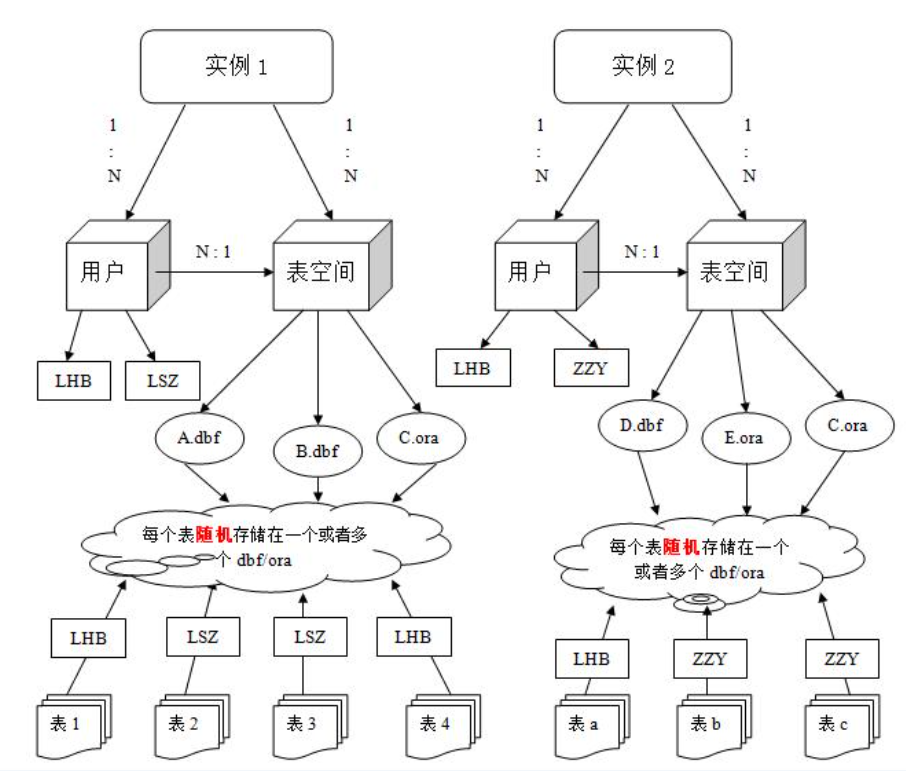

**命令行启动相关：**

```
lsnrctl status
# 启动服务
sqlplus
# 登录选项
```

**结构相关SQL语句**

创建表空间

```sql
create tablespace TABLESPACE_QCJ
	datafile 'path/filename.dbf' 
	size 500M autoextend on next 5M maxsize unlimited; 
```

创建用户

```sql
create user UserName 
	IDENTIFIED BY PassWord 
	default tablespace TableSpaceName
	temporary tablespace TEMP 
	profile DEFAULT;
```

用户相关

```sql
  /*用户权限*/
grant connect,resource,dba to UsrName;
  /*查询当前用户的表空间*/
select UsrName,default_tablespace from user_users;
  /*修改用户的默认表空间*/
alter user UsrName default tablespace TableSpaceName; 
  /*修改用户密码*/
alter user UsrName identified by PassWord；
/*查询所有表空间物理位置*/
  select name from v$datafile;
  /*查询当前用户的表空间*/
  select username,default_tablespace from user_users;
```


使用imp导入dmp文件：

```sql
imp UsrName/PassWord file=path\filename full=y ignore=y;
```


**SELECT相关SQL语句**

查询某张表下所有字段的名字

```SQL
SELECT * FROM user_col_comments where Table_Name = 'TableName'
```

查询用户下所有表的名字

```sql
select * from user_tab_comments;
```


##### python编程(函数对象，匿名函数)

**函数对象：**

```python
def func1():
	pass
def fun2():
	pass
funclist=[func1,func2]
for fun in funclist
	pirnt(fun())
```

**匿名函数：**

```python
lambda x: x**2
```


#### 6.19

##### Pandas相关

重置index

```python
df.reset_index(drop=True)
```


#### 6.21、6.22

##### Paper: Origin-Destination Matrix Prediction via Graph Convolution: a New Perspective of Passenger Demand Modeling

如何表现OD？ OD应当是一段时间的特征，如何表现一个时刻的

**ODMP特点：**

（1）需要同时预测需求和目的地

（2）矩阵**极其稀疏**

（3）考虑**时间和空间**两部分的**融合预测**


**GEML 模型：**

​	分为时域的Multi-task Learning部分(含感知稀疏性以及数据范围的聚合器)

​			空间域的Grid-Embedding 部分

稀疏性的解决方法：

​			扩散，邻近原则:某栅格受到邻近栅格的影响，且越近的栅格，影响越大。考虑两种邻近关系：

​	Geographical & Semantic Neighbors

​	前者为物理意义上的邻近，后者为OD对意义上的邻近

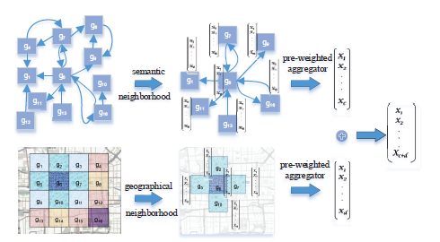

**Solution**

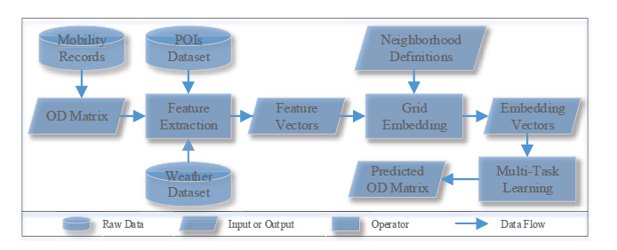

​			

##### GCN(transductive)

​		GCN研究特征（Feature）和消息（Message）在Graph Network中流动和传播。这个传播最原始的形态就是状态的变化正比于相应空间二阶微分作用在当前的状态（邻节点对当前节点的作用）。在二维离散空间上，二阶微分对应为拉普拉斯算子$$\Delta$$,在图空间中，对应为拉普拉斯矩阵$$L$$

**Graph Convolution**

​	在**Euclidean Structure**的结构中，可以利用卷积提取，在图空间中，可以将卷积和傅里叶变换推广，其中拉普拉斯算子和拉普拉斯矩阵地位等价，由此可以推广，如基函数$$e^{-i\omega t}$$ 对应拉普拉斯矩阵的特征向量。通过矩阵分解拉普拉斯矩阵有：

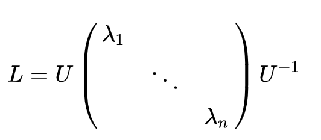

​		U为单位特征向量构成的矩阵$$\lambda$$ 为对应特征向量的特征值

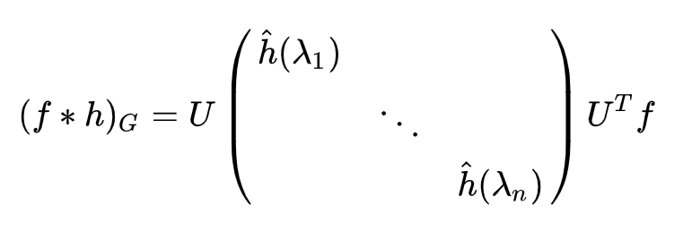
$$
y=(x*h)_G=U\hat{h}(\Lambda)U^Tx
$$
**GCN：**

​		GCN的每一层之间都是一次卷积计算，每一层之间都是共享参数，局部感受野

​		**二代卷积核**
$$
\hat{h}(\lambda_l)=\sum_{j=0}^K\alpha_j\lambda^j_l
$$
​		这样设计的好处是可以不用去算特征值，在运算过程中自然归到拉普拉斯矩阵当中：
$$
y=\sigma(\sum_{j=0}^{K-1}\alpha_j L^j x)
$$
​		$$\alpha$$ 为训练参数，$$K$$即为感知野

​		**三代卷积核**

​			通过切比雪夫近似，卷积运算近似为：
$$
\hat h(\Lambda)=\sum_{k=0}^{K-1}\beta_kT_k(\hat \Lambda)
$$
​			其中，$$T_k()$$ 是 $$k$$ 阶的Chebyshev多项式，$$\beta_k$$是训练参数。$$\hat \Lambda$$ 是re-scaled（[-1,1]）的特征值对角矩阵（$$\hat \Lambda=2\Lambda/\lambda_{max}-I$$）$$\lambda_{max}$$用幂迭代法。

​			那么有：
$$
y=\sigma(\sum_{k=0}^{K-1}\beta_k T_k(\hat L) x)
$$
​			其中$$\hat L=2L/\lambda_{max}-I$$,$$K$$即为感知野，一般可以取2，即两层neibour，并近似$$\lambda_{max}=2$$（graph Laplacian性质）：
$$
y\approx \sigma(\beta_0 H^l+\beta_1(L-I)x)
$$
​			定义对称归一化拉普拉斯矩阵$$L^{sys}$$：
$$
L^{sym}=D^{-1/2}LD^{-1/2}=I-D^{-1/2}AD^{-1/2}
$$
​			有(取$$\beta=\beta_0=-\beta_1$$)
$$
y\approx\sigma(\beta_0 x-\beta_1D^{-1/2}AD^{-1/2}x)=\sigma(\beta(I+D^{-1/2}AD^{-1/2})x)
$$
​			原论文中提到此时$$I+D^{-1/2}AD^{1/2}$$的特征值在[0,1]之间，层之间的迭代可能导致numerical instabilities、exploding/vanishing gradients，提到**renormalization trick**
$$
I+D^{-1/2}AD^{-1/2}\rightarrow \hat D^{-1/2}\hat A\hat D^{-1/2}\\
\hat A=A+I \space \&\hat D_{ii}=\sum_j \hat{A}_{ij}
$$

$$
y\approx\sigma(\beta\hat D^{-1/2}\hat A\hat D^{-1/2}x)
$$

​			最终，对于整层来说有
$$
H^{l+1}\approx\sigma(\hat D^{-1/2}\hat A\hat D^{-1/2}H^lW(l))=\sigma(\tilde{A}H^lW(l))
$$
​			$$\tilde{A}$$:  n*n  (n为节点数)

​			$$H$$: n*m  (m为特征维度)

​			$$W$$：m*u (u为神经网络层单元数) 

​		注：1.DL中卷积与数学上的卷积意义稍有不同，本质为可**训练的共享参数的卷积核**

​				2.GCN适用于无向图，因为拉普拉斯矩阵一定可以分解是建立在其是半正定的基础上的（无向图实对称），有向图考虑node-wise，如GraphSage、GAT

##### GraphSage(inductive)

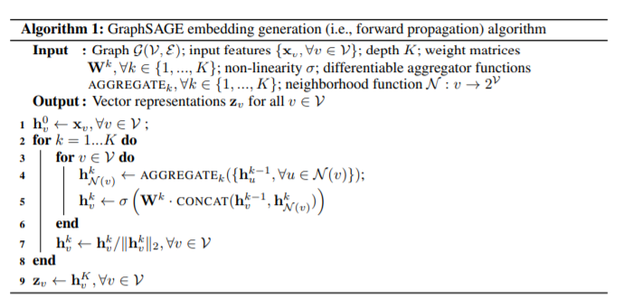

​			训练K个aggregator,进行K次聚合，每次聚合：

​		（1）将节点一阶邻近节点的K-1次embedding送入aggreator得到聚合特征

​		（2）contact聚合特征与节点上一次embedding得到本次embedding

 		**常见聚合函数：**

​		1.平均聚合

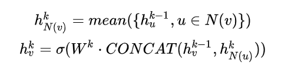

​		2.融合聚合

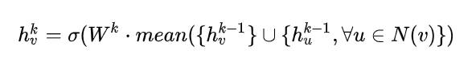

##### LSTM

​		长短期记忆网络是一种特殊的RNN，单个cell中有四个网络层交互

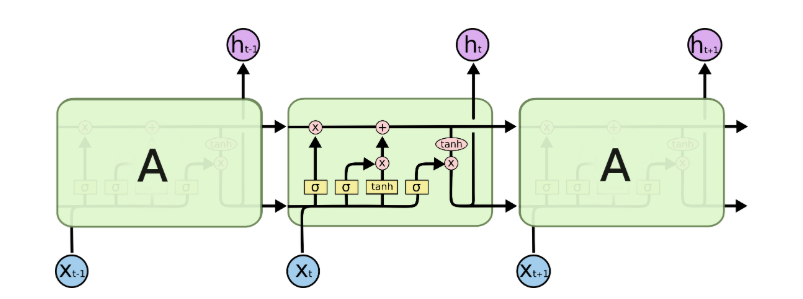

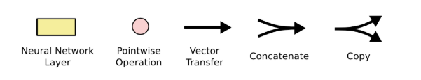

LSTM中存在两个信息流，**c&h**：

​			**c(cell state)** 改变的很慢，对应较长且稳定的短时记忆，在单个cell中的运算是**forget & update**

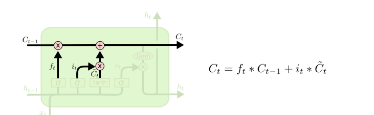

​		forget 依靠sigmod（forget）的门控作用实现，以此过滤掉不重要的信息，update由sigmod（in）以及tanh组成，前者过滤需要更新的值，后者产生待更新的值


​		**h(hidden state)**则可能变化的很快，对应短时记忆，在单个cell中的运算与update类似，通过sigmoid（out）门控作用筛选出需要传递(用作下一次运算的前馈信息)与输出的信息，具体信息来自于c。其中的输出$$h_t$$是我们真正需要的内容

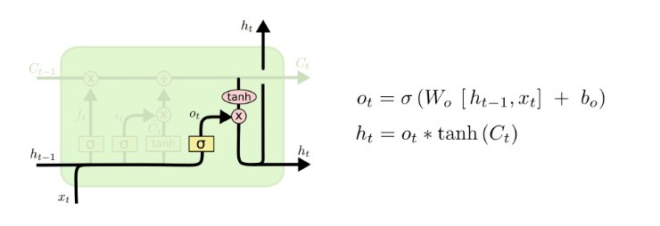


**注：** 1.激活函数，sigmod映射到【0，1】符合门控的物理意义，tanh映射到【-1，1】有良好的性质，解决梯度弥散问题，能较快收敛		

​		 2.具体维度变化：

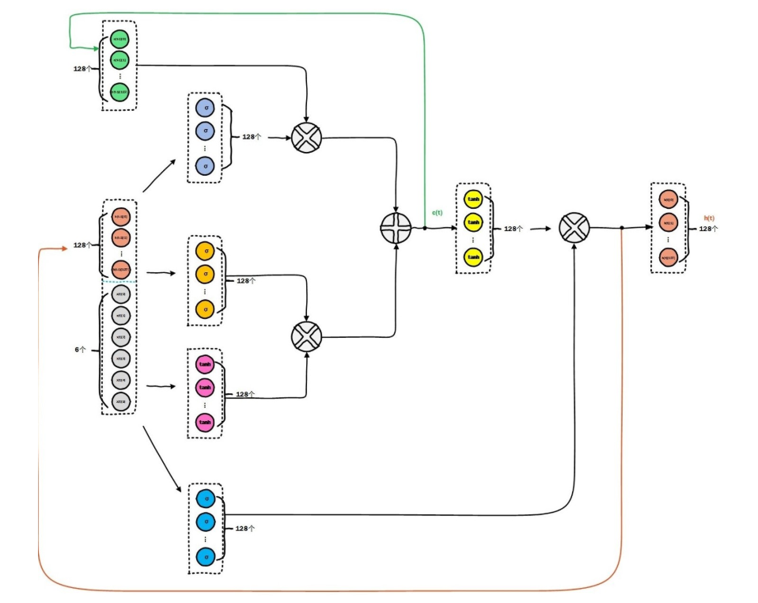